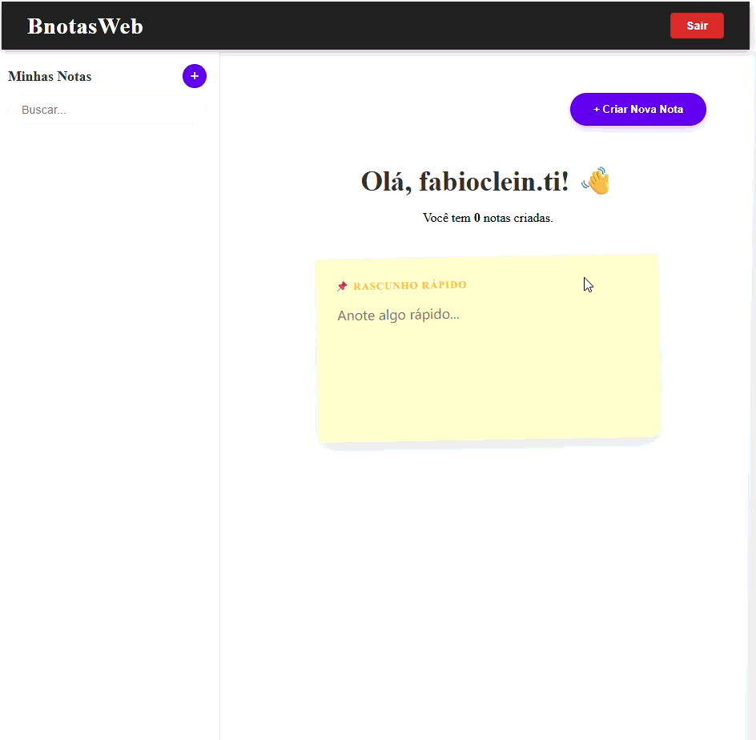

# 📝 BnotasWeb

Um gerenciador de notas adesivas (sticky notes) inteligente, desenvolvido com **Angular 16+ (Standalone Components)**. O projeto apresenta um editor de texto rico (WYSIWYG) customizado, com controle granular de estilização e manipulação avançada do DOM.



> 🚧 **Status do Projeto: Em Evolução Contínua** > Este projeto encontra-se em **desenvolvimento ativo**. O objetivo é modernizar e simplificar constantemente a experiência do usuário. Embora novas funcionalidades estejam sendo desenhadas para facilitar ainda mais o dia a dia, **todos os recursos listados abaixo estão 100% testados, estáveis e aptos para uso.**

## 🚀 Visão Geral

Este projeto é uma **Single Page Application (SPA)** focada em produtividade. O grande diferencial técnico reside na **implementação manual da lógica de edição de texto**. Em vez de depender apenas de bibliotecas prontas, foi desenvolvida uma engine própria sobre o `contenteditable` para contornar limitações nativas dos navegadores, garantindo persistência de estilos complexos e uma experiência de usuário fluida.

## ✨ Funcionalidades Detalhadas (Versão Estável)

O BnotasWeb vai além de simples anotações, funcionando como um sistema completo de organização pessoal. As funcionalidades abaixo estão operacionais:

### 1. 🎨 Editor de Texto Rico (Custom Engine)
* **Formatação Essencial:** Negrito, Itálico e Sublinhado com lógica de "fuga" para não prender o cursor.
* **Marca-Texto Inteligente:** Cores de fundo dinâmicas com função de parada.
* **Tipografia Controlada:** Alteração de tamanho (Pequeno, Médio, Grande) e cor da fonte com feedback visual instantâneo na barra de ferramentas.
* **Reset (Tx):** Botão de limpeza que normaliza o texto e remove formatações aninhadas.

### 2. 🗂️ Organização & Produtividade
* **Navegação "Deck" (Baralho):** Interface inovadora na sidebar onde o usuário usa o scroll (wheel) para rodar entre notas de um mesmo grupo de cor, economizando espaço em tela.
* **Categorização por Cores:** As notas funcionam como pastas temáticas baseadas em suas cores.
* **Rascunho Rápido (Scratchpad):** Uma área de transferência persistente (Local Storage) para anotações voláteis que não precisam virar um card.
* **Busca Instantânea:** Filtro em tempo real por título ou conteúdo.

### 3. ⏰ Sistema de Alertas
* **Agendamento:** Definição de datas e horários para lembretes em cada nota.
* **Modal de Urgência:** Interface de "Atenção Máxima" que alerta sobre tarefas vencidas.
* **Ações Rápidas:** Opções para concluir ou adiar (Snooze) tarefas diretamente do alerta.

### 4. 👤 Gestão de Usuário
* **Identificação:** Sistema que personaliza a interface com o nome do usuário (extraído do e-mail/auth).
* **CRUD Completo:** Criação, leitura, atualização e exclusão de notas integradas ao Backend.

## 🛠️ Destaques Técnicos & Desafios Superados

Este é o ponto alto do projeto para avaliação técnica. O desenvolvimento exigiu domínio sobre a API de **Selection** e **Range** do navegador:

1.  **Persistência de Estilo (Cursor Tracking):**
    * *Desafio:* Navegadores tendem a resetar a formatação (cor/tamanho) para o padrão ao pular uma linha ou mover o cursor para o início de um bloco.
    * *Solução:* Implementação da técnica **"Zero Width Space Injection" (\u200B)**. O código injeta spans invisíveis com o estilo desejado e força o cursor para dentro deles, garantindo que a escolha do usuário (ex: letra grande e vermelha) persista mesmo em novas linhas.

2.  **Lógica de "Fuga" Recursiva:**
    * *Desafio:* Ficar "preso" dentro de tags como `<u>` ou `<span style="background...">` ao tentar desligar um estilo.
    * *Solução:* Algoritmos (`performEscape`, `escapeSpecificTag`) que analisam a árvore do DOM a partir do cursor, encontram o nó pai estilizado e movem fisicamente o `Range` para fora dele.

3.  **Sincronização UI/Estado (Two-way binding visual):**
    * A barra de ferramentas lê dinamicamente o `Computed Style` na posição do cursor. Se você clica em um texto vermelho, o botão de cor na toolbar atualiza automaticamente para vermelho.

4.  **UX Interativo (Tilt Effect):**
    * Diretiva personalizada que calcula a posição do mouse relativa ao card para aplicar uma transformação 3D suave (CSS Transform), aumentando a imersão.

## 💻 Tecnologias

* **Framework:** Angular 16+ (Standalone Components)
* **Linguagem:** TypeScript
* **Estilização:** SCSS / CSS3 (CSS Variables, Flexbox, Grid)
* **Core:** HTML5 `contenteditable` API, DOM Manipulation API

## 📦 Como Rodar o Projeto

1.  **Clone o repositório:**
    ```bash
    git clone [https://github.com/fabiocleinti-eng/BnotasWeb-Front-end.git](https://github.com/fabiocleinti-eng/BnotasWeb-Front-end.git)
    ```
2.  **Instale as dependências:**
    ```bash
    npm install
    ```
3.  **Execute o servidor de desenvolvimento:**
    ```bash
    ng serve
    ```
4.  Acesse `http://localhost:4200/`.

## 👨‍💻 Autor

Desenvolvido por **Fábio Clein**.
Entre em contato: [LinkedIn](https://www.linkedin.com/in/f%C3%A1bio-clein-8aabb5325/) | fabioclein.ti@gmail.com

---
*Projeto desenvolvido para fins de estudo e demonstração de competências avançadas em Front-end Engineering.*